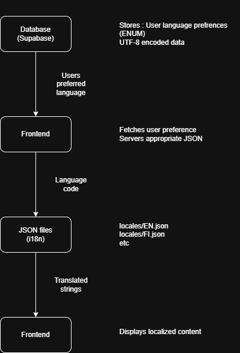

# Localization plan and report

## Overview

This project implements localization through **i18n** with JSON translation files. User language prefrences are stored as a ENUM type in the database, while UI strings are maintained in the JSON files.

### Supported languages
- English (EN) - default
- Finnish (FI)
- Swedish (SE)
- Kurdish (KU)
- Vietnamese (VN)
- Ukrainian (UK)
- Hindi (HI)

## Localization method architecture


## Why?

### Pros
-  **Easy to maintain** - Translations in JSON files
- **Version controllerd** - Translation changes tracked in git
- **Performance** - No databse JOINs for UI strings
- **Developer friendly** - Clear separation for code and content
- **Type safe** - ENUM prevents invalid language codes
- **Scalable** - Can add language translations by adding JSON files

### Cons
- Requires deployment to update translations
- User-generated ccontent is not handeld

## JSON file format
```json
{
    "key": "value",
    "example": "Translation text"
}
```

See [translation files](../App/frontend/src/locales/) for complete examples.

## Character encoding

### Database configuration
```sql
-- WARNING: This schema is for context only and is not meant to be run.
-- Create database with UTF-8 encoding  (Supabase/PostgresSQL)
CREATE DATABASE notely_db
    WITH
    ENCODING = 'UTF8'
    LC_COLLATE = 'en_US.UTF-8'
    LC_CTYPE = 'en_US.UTF-8'
    TEMPLATE = template0;

SET client_encoding ='UTF8'

```

### JSON file encoding
- All JSON files must be saved as UTF-8
- Supports all special characters
- No need to escape Unicode characters

## i18n config files

Implementation configuration files

See [config](../App/frontend/src/i18n/config.js) for complete implementation.
See [i18n](../App/frontend/src/i18n/i18n.js) for complete implementation.

### config.js
```js
export const locales = ["EN", "VN", "KU", "SE", "FI", "HI", "UA"];
export const defaultLocale = "EN";
export const languages = {
    EN: "English",
    VN: "Vietnamese",
    KU: "Kurdish",
    SE: "Swedish",
    FI: "Finnish",
    HI: "Hindi",
    UA: "Ukrainian",
};
```
### i18n.js
```js
import i18n from "i18next";
import { initReactI18next } from "react-i18next";
import { locales, defaultLocale } from "./config";
import LanguageDetector from 'i18next-browser-languagedetector';

import en from "../locales/en.json";
import vn from "../locales/vn.json";
import ku from "../locales/ku.json";
import se from "../locales/se.json";
import fi from "../locales/fi.json";
import hi from "../locales/hi.json";
import uk from "../locales/uk.json";

i18n
    .use(LanguageDetector)
    .use(initReactI18next)
    .init({
        fallbackLng: defaultLocale,
        supportedLngs: locales,
        resources: {
            EN: { translation: en },
            VN: { translation: vn },
            KU: { translation: ku },
            SE: { translation: se },
            FI: { translation: fi },
            HI: { translation: hi },
            UA: { translation: uk },
        },
        detection: {
            order: ['cookie'],
            caches: ['cookie'],
            cookieMinutes: 60 * 24 * 30,
        },
        interpolation: {
            escapeValue: false,
        },
    });

export default i18n;
```


## Usage through language selector component

LanguageDropdown component 

See [LanguageDropdown](../App/frontend/src/components/ui/popups/hooks) for complete implementation.


## Adding new translations

1. Add new localization translation file
2. Add new language enum in DB
3. Update configuration files with language codes
4. Validation script to check keys

### Localization file key validation script


See [Validation script](../App/frontend/src/components/ui/popups/hooks) for complete implementation.

## Tests

- Language selector tests ([Cypress e2e tests](../App/frontend/src/cypress/e2e/notes.cy.js))

## Refrences 

- [i18n documentation](https://www.i18next.com/)


